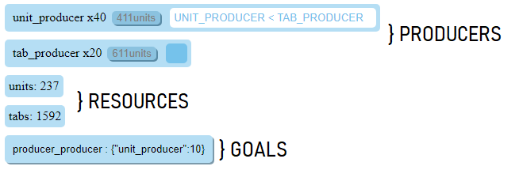

## Condicremental

Condicremental is an incremental game with player-programmable buy conditions.

The game is written in Javascript and uses React.js for frontend.

### Game Rules

For reference, an incremental game is a generally defined as a game where the player has to click a button to earn currency.
Usually, this currency can be spent to get items which allow the player to attain the same or different currencies faster.
Often times, certain goals must be met in order for some items to become available to the player. 

In other incremental games, the player must click buttons to purchase items or to produce currency. 
In Condicremental, the player can instead write logical expressions which specify buy conditions for items.
No more carpel tunnel!

The game world has 3 classes. Resources are akin to currency and are accumulted by the user to purchase Producers and Goals.
Producers are Resources, but have a Resource output every game tick.
Some Resources are not available to players initially.
Goals allow the player to unlock Resources by meeting a Resource or Goal prerequisite, then paying a Resource cost.
Goals, once paid for, can unlock Resources and other Goals, and can provide amounts of Resources.

### Notes for Extension

The game is currently more a proof-of-concept than anything anything else and is certainly not finished (but probably won't be developed further). 
`buider_gui.py` is a pyqt5 GUI app that allows the user to construct a set of goals with Resource/Producer name recommendations. 
The user should manually fill out auto-generated Resource/Producer fields after the app generates a .json file.
The json string should then be copied into the data_str variable in `components.js`. 

To use `builder_gui.py`, you'll need to `pip install pyqt5 graphviz` and install the Graphviz application (and add it's executable to PATH).
